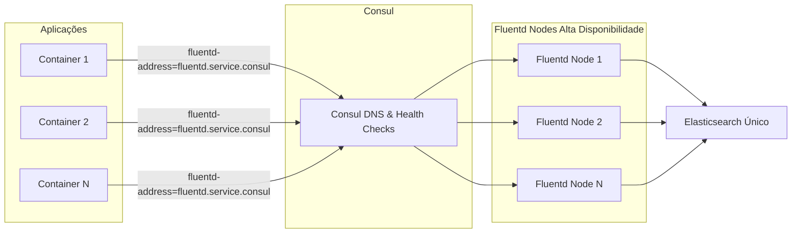
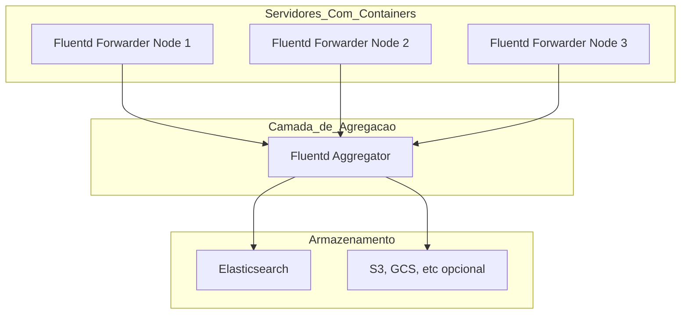
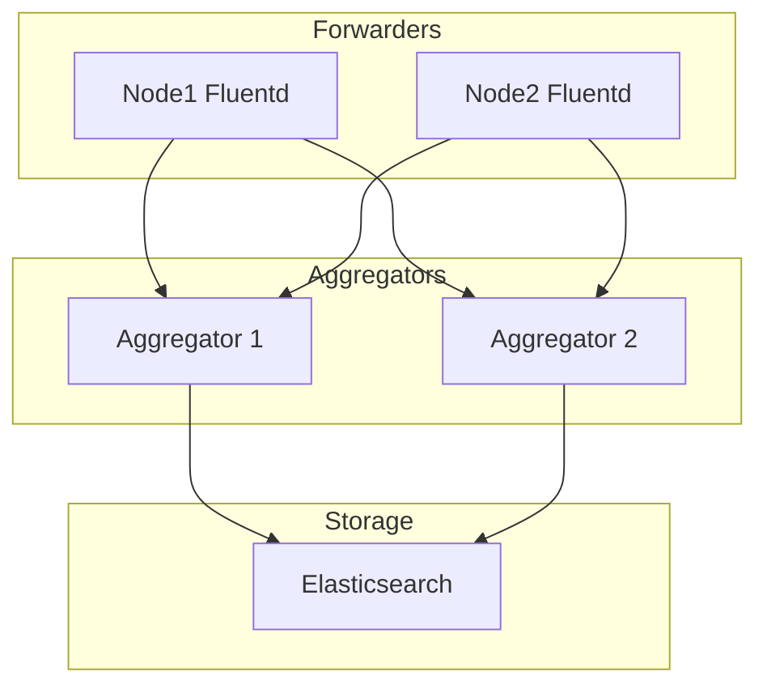

# Documentação da Pesquisa, Testes e Avaliação da Stack EFK (Elasticsearch, Fluentd, Kibana)

## Objetivo
Centralizar e visualizar os logs gerados pelos containers utilizando uma stack eficiente e escalável de coleta, armazenamento e análise de logs. A stack escolhida para testes é composta por:

- [Fluentd](https://docs.fluentd.org/) – como agente de coleta e roteamento de logs.

- [Elasticsearch](https://www.elastic.co/docs/get-started/) – como motor de indexação e busca.

- [Kibana](https://search.elastic.co/pt?q=kibana&location%5B0%5D=Documentation) – como interface visual para consulta dos logs.


### Links utilizados para pesquisa
- [EFK Stack: Logs Além da Depuração](https://biahyonce.medium.com/efk-stack-logs-al%C3%A9m-da-depura%C3%A7%C3%A3o-672adeed606b)
- [Documentação Fluentd](https://docs.fluentd.org/)
- [Documentação Fluentd - Deploy com Compose](https://docs.fluentd.org/container-deployment/docker-compose)
- [Documentação Fluentd - Plugin Elastic Search](https://github.com/uken/fluent-plugin-elasticsearch/tree/v6.0.0?tab=readme-ov-file#installation)
- [Documentação Fluentd - Configuração conexão com Elasticsearch](https://docs.fluentd.org/output/elasticsearch)
- [Documentação Docker - Logging Drivers Fluentd](https://docs.docker.com/engine/logging/drivers/fluentd/)
- [Docker hub - Imagens do Fluentd, Elasticsearch e Kibana](https://hub.docker.com/)
- [Métodos Ruby no Filtro do Fluentd](https://docs.ruby-lang.org/en/master/Socket.html#method-c-gethostname)

### Planejamento do Ambiente de Teste
#### Requisitos
- Docker e Docker Compose.
### PRD - Logging Driver with Consul
#### Cenário: Você tem uma camada de Fluentd para balancemento de carga com consul e nginx, e as aplicações enviam os logs diretos para essa camada de fluentd
#### Funcionamento: As aplicações enviam os logs para um ou mais Fluentd que atuam como aggregator e enviam os logs para o elasticsearch

#### Iniciar ambiente prd-consul
```bash
cd .\prd-consul\
```
```bash
docker compose up --detach
```
#### Comandos após compose up
Registrar serviço no consul
```bash
curl --request PUT --data @fluentd-n1.json http://localhost:8500/v1/agent/service/register
```
Configurar e reinicializar o nginx, dentro do container do nginx:
```bash
cat /consul/fluentd.conf >> /etc/nginx/nginx.conf
```
```bash
service nginx reload
```
A aplicação web não irá iniciar com o compose up pois o nginx precisa ser configurado antes, então após as configurações do nginx a aplicação web deve ser incializada com
```bash
docker compose up --detach
```
#### Comando de teste
```bash
curl http://localhost:8080
```
### Vantagens x Desvantagens
| Vantagens  | Desvantangens |
| ------------- | ------------- |
| Menos I/O: Evita sobrecarga no host por escrita em massa de logs  | Integração: Se o fuentd ou rede ficar indisponível, os containers podem travar ou perder logs   |
| Baixa Latência: Logs vão direto do container para o fluentd, sem escrita em disco  | Resiliência a falhas: O Driver fluentd no docker tem limitação e pode perder logs em caso de sobrecarga |
#### Observações
- Ideal para ambientes que precisam de informação em tempo real, que possuam rede estável e tolerância a alguma perda de log


### PRD - Alta Disponibilidade
#### Cenário: Você tem um agente Fluentd em cada host/container que envia logs para um Fluentd central
#### Funcionamento: Um ou mais Fluentd atuam como forwarders e enviam os logs para um Fluentd aggregator usando o protocolo nativo do Fluentd (forward)
Conceito Base

Arquitetura com HA

#### Iniciar ambiente prd-ha
```bash
cd .\prd-ha\
```
```bash
docker compose up --detach
```
#### Comando de teste
```bash
curl http://localhost:8080
```
### Vantagens x Desvantagens
| Vantagens  | Desvantangens |
| ------------- | ------------- |
| Desacoplamento: Containers não dependem do destino final pois os logs são salvos localmente  | Maior latência: Logs passam pelo disco e depois vão para o master  |
| Resiliente a falhas: Se o master ou elastic cair os workers continuam coletando os logs e depois reenviam  | Mais I/O no host: Gravação e Leitura de arquivos de log podem pesar em ambientes com muito tráfego  |
#### Observações
- Ideal para ambientes que precisam de armazenamento garantidos de logs e tolerância a falhas de rede/infra
- Como ficaria a separação em relação ao fluentd?
Separar por tipo de log que o container gera, então para cada tipo de log se teria um fluentd ou separar por tipo de aplicação web, android, go, delphi e para cada um ter um fluentd
- No modo de HA deve ter uma forma de identificar os containers que estão enviando os logs
- No modo de HA deve ter rotação de logs

### quick-start
Teste realizado com base na documentação oficial do Fluentd para deploy via Docker Compose.
Foram utilizadas apenas configurações básicas com o objetivo de validar rapidamente o funcionamento da stack.
Esta configuração não atende aos requisitos do ambiente de produção.

#### Iniciar ambiente quick-start
```bash
cd .\quick-start\
```
```bash
docker compose up --detach
```
#### Comando de teste
```bash
curl http://localhost:8080
```
> Caso a aplicação web não inicie corretamente ao executar `docker compose up --detach`, basta inicializá-la manualmente separadamente.

## TO-DO Rotacionamento de logs