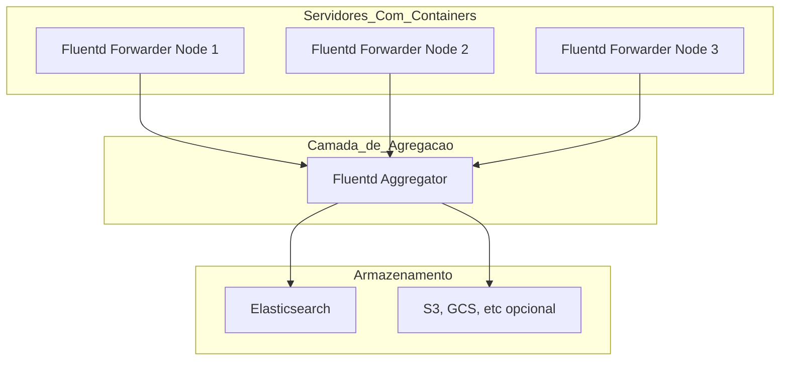
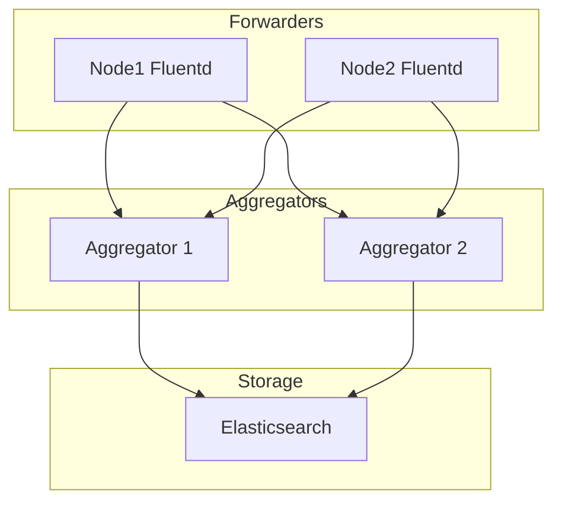

# Documentação da Pesquisa, Testes e Avaliação da Stack EFK (Elasticsearch, Fluentd, Kibana)

## Objetivo
Centralizar e visualizar os logs gerados pelos containers utilizando uma stack eficiente e escalável de coleta, armazenamento e análise de logs. A stack escolhida para testes é composta por:

- [Fluentd](https://docs.fluentd.org/) – como agente de coleta e roteamento de logs.

- [Elasticsearch](https://www.elastic.co/docs/get-started/) – como motor de indexação e busca.

- [Kibana](https://search.elastic.co/pt?q=kibana&location%5B0%5D=Documentation) – como interface visual para consulta dos logs.


### Links utilizados para pesquisa
- [EFK Stack: Logs Além da Depuração](https://biahyonce.medium.com/efk-stack-logs-al%C3%A9m-da-depura%C3%A7%C3%A3o-672adeed606b)
- [Documentação Fluentd](https://docs.fluentd.org/)
- [Documentação Fluentd - Deploy com Compose](https://docs.fluentd.org/container-deployment/docker-compose)
- [Documentação Fluentd - Plugin Elastic Search](https://github.com/uken/fluent-plugin-elasticsearch/tree/v6.0.0?tab=readme-ov-file#installation)
- [Documentação Fluentd - Configuração conexão com Elasticsearch](https://docs.fluentd.org/output/elasticsearch)
- [Documentação Docker - Logging Drivers Fluentd](https://docs.docker.com/engine/logging/drivers/fluentd/)
- [Docker hub - Imagens do Fluentd, Elasticsearch e Kibana](https://hub.docker.com/)

### Planejamento do Ambiente de Teste
#### Requisitos
- Docker e Docker Compose.

### PRD - Alta Disponibilidade
#### Cenário: Você tem um agente Fluentd em cada host/container que envia logs para um Fluentd central
#### Funcionamento: Um ou mais Fluentd atuam como forwarders e enviam os logs para um Fluentd aggregator usando o protocolo nativo do Fluentd (forward)
Conceito Base

Arquitetura com HA

#### Iniciar ambiente prd-ha
```bash
cd .\prd-ha\
```
```bash
docker compose up --detach
```
#### Comando de teste
```bash
curl http://localhost:8080
```

### quick-start
Teste realizado com base na documentação oficial do Fluentd para deploy via Docker Compose.
Foram utilizadas apenas configurações básicas com o objetivo de validar rapidamente o funcionamento da stack.
Esta configuração não atende aos requisitos do ambiente de produção.

#### Iniciar ambiente quick-start
```bash
cd .\quick-start\
```
```bash
docker compose up --detach
```
#### Comando de teste
```bash
curl http://localhost:8080
```
> Caso a aplicação web não inicie corretamente ao executar `docker compose up --detach`, basta inicializá-la manualmente separadamente.